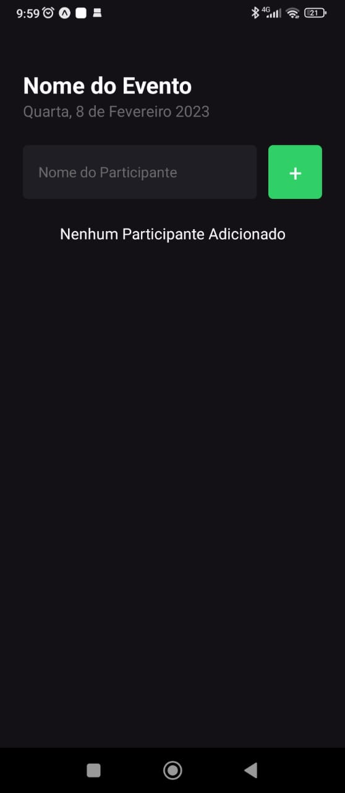
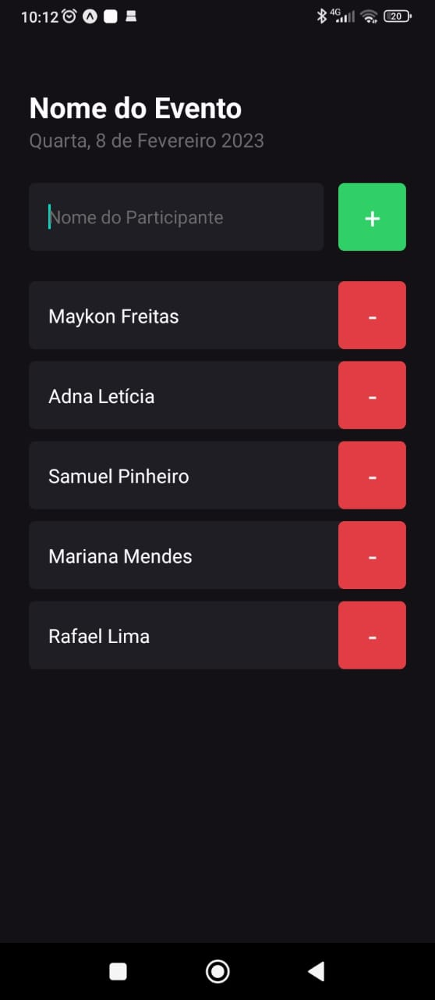
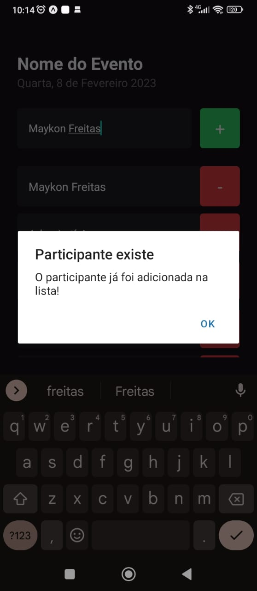
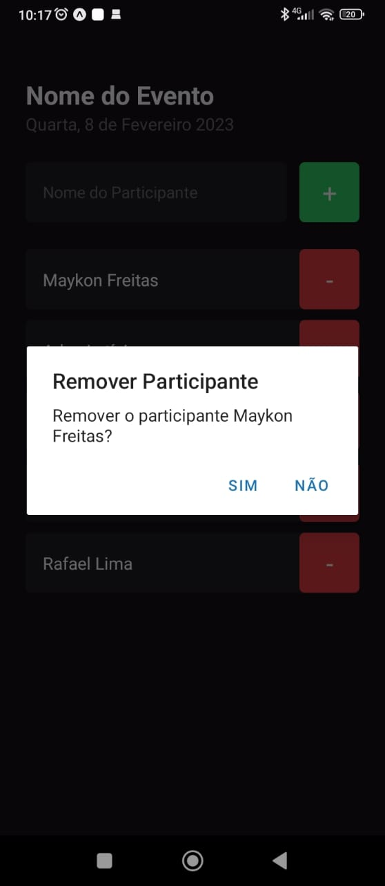

# Projeto: I AM HERE

O aplicativo I AM HERE, serve para listar pessoas participantes de eventos, podendo adicionar e remover participantes da lista. O app também conta com algumas funcionalidades interessantes, por exemplo:

* validar a existe de nomes na lista, podendo apenas adicionar um participante, caso ele não esteja na lista.
* Exibição de Alerts, para mostrar mensagens de retorno de ações feitas pelo o usuário, e para pedir confirmações do usuário (Para Remover um participante da lista, por exemplo).


## 🚀 Começando

Essas instruções permitirão que você obtenha uma cópia do projeto em operação na sua máquina local para fins de desenvolvimento e teste.

### 📋 Pré-requisitos

* cURL
* Node.js (LTS);
* npm (já vem instalado com o Node);
* expo-cli
* Expo GO (Android e/ou iOS)


### 🔧 Instalação

Para instalar o cURL, caso já não esteja instalado em sua máquina, use o comando: 

```
sudo apt-get install curl
```
Para verificar a instação do cURL, rode o comando:

```
curl --version
```

Para instalar o Node e o NPM, que já vem com a instalação do Node, recomendo utilizar o NVM, para instalar o NVM, acesse o [Repositório Oficial do NVM](https://github.com/nvm-sh/nvms);

Depois de instalado o NVM e uma versão do Node (recomendo a versão 16), você pode validar as instalações utilizando os comandos:

```
node -v
npm -v
```

## Usando ExpoCLI
O Expo CLI faz parte do pacote `expo` e você pode usá-lo aproveitando `npx` — um executor de pacote Node.js. Nenhuma instalação é necessária. Em caso de dúvidas, acesse o [Site Oficial do Expo](https://expo.dev/);

## Expo GO

Expo Go é um aplicativo que está disponível nas lojas de apps da google e apple. Ele permite que você abra os aplicativos que estão sendo servidos através do Expo CLI apenas lendo o QR Code gerado no browser ou no terminal.


## :iphone: Utilizando o App

Antes de começar, clone o repositório:

```
git clone git@github.com:MaykonFreitas17/project-react-native-iamhere.git
```
Acesse a pasta do projeto

```
cd project-react-native-iamhere
```
Instale as dependências do projeto

```
npm install
```
Para executar o aplicativo usando o Expo CLI e o Expo GO, rode o comando:

```
npx expo start
```
Após executar o comando, será gerado uma QR Code no terminal, acesse o aplicativo do Expo GO, e selecione a opção `Scan QR Code`, e escanei o QR Code. E Pronto, provavelmente, o aplicativo vai estar rodando no seu dispositivo físico.

⚠️ Lembrando que a máquina e o dispositivo (Android/IOS) devem estar na mesma rede de internet.

## 🛠️ Construído com

* [React Native](https://reactnative.dev/) - O framework usado para desenvolver aplicativos para os sistemas Android e iOS de forma nativa
* [React](https://pt-br.reactjs.org/) - Biblioteca front-end JavaScript de código aberto com foco em criar interfaces de usuário em páginas web.
* [NPX](https://maven.apache.org/) - ferramenta de interface de linha de comando, cujo propósito é facilitar a instalação e o gerenciamento de dependências hospedadas no registro do npm
* [Typescript](https://www.typescriptlang.org/) - Superconjunto de JavaScript, ou seja, um conjunto de ferramentas e formas mais eficientes de escrever código JavaScript, adicionando recursos que não estão presentes de maneira nativa na linguagem.
* [Expo](https://expo.dev/) - conjunto de ferramentas e serviços construídos em torno de plataformas nativas e React Native que ajudam você a desenvolver, construir, implantar e iterar rapidamente em aplicativos iOS, Android e web a partir da mesma base de código JavaScript/TypeScript.


## :camera_flash: ScreenShot

#### Tela Principal do Aplicativo (sem participantes adicionados)


#### Tela Principal do Aplicativo (com participantes adicionados)


#### Tela Principal do Aplicativo (tentando adicionar um participante existente na lista)


#### Tela Principal do Aplicativo (removendo um participante da lista)


---
⌨️ O módelo do README.md utilizado nesse projeto foi feito por [Armstrong Lohãns](https://gist.github.com/lohhans)